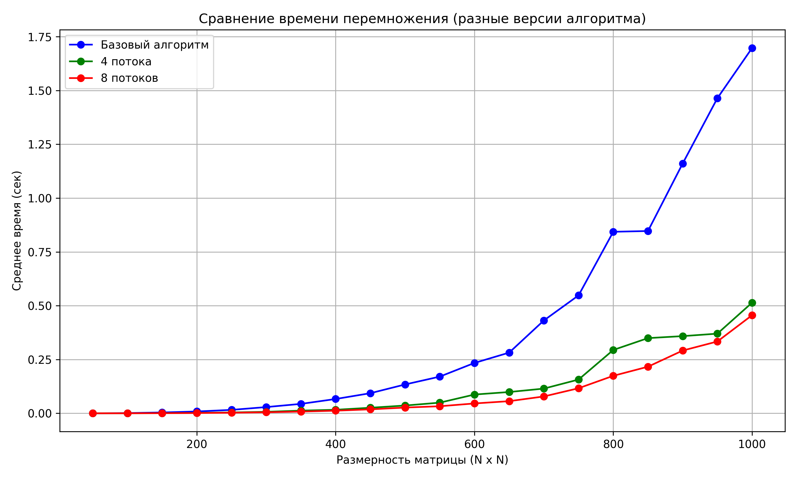

## Отчет по лабораторной работе №4 

### Задание на лабораторную работу: 
   В данной лабораторной работе реализована параллельная версия алгоритма умножения квадратных матриц с использованием технологии CUDA.

 Starring:
    [Сидорчук Кирилл](https://github.com/Defoult13), [Козловская Ксения](https://github.com/Pomi44), [Спиридонова Ксения](https://github.com/kksseonn), [Ульянов Александр](https://github.com/Sanechek600)

### Файлы:
* [main.cu](main.cu) - основное задание: генерация, запись/чтение матриц из файлов, их умножение и подсчет времени
* [check.py](check.py) - модуль с функцией проверки полученных результатов с помощью библиотеки numpy (так же чертит график зависимости времени от размера)
* [input](input) - папка со всеми сгенерированными матрицами и результатами их перемножения (в репозитории папка отсутствует так как в ней 600 текстовых файлов матриц, при необходимости могу загрузить эту папку)
* [timing_results.txt](timing_results.txt) - файл, содержащий размеры матриц и среднее время их перемножения (количество экспериментов - по 10 матриц каждой размерности)
* [timing_results(4th).txt](timing_results(4th).txt) - файл, содержащий размеры матриц и среднее время их перемножения (количество экспериментов - по 10 матриц каждой размерности). Выполнено в 4 потока.
* [timing_results(8th).txt](timing_results(8th).txt) - файл, содержащий размеры матриц и среднее время их перемножения (количество экспериментов - по 10 матриц каждой размерности). Выполнено в 8 потоков.
* [timing_results(8).txt](timing_results(8).txt) - файл, содержащий размеры матриц и среднее время их перемножения (количество экспериментов - по 10 матриц каждой размерности). Выполнено с использованием CUDA. BlockSize = 8.
* [timing_results(8).txt](timing_results(16).txt) - файл, содержащий размеры матриц и среднее время их перемножения (количество экспериментов - по 10 матриц каждой размерности). Выполнено с использованием CUDA. BlockSize = 16.
* [verification.log](verification.log) - файл, содержащий логи проверки правильности перемножения матриц

### CUDA:
Для распараллеливания умножения матриц были использованы:
- `__global__ void matrixMultiplyKernel(...)`
Это ядро CUDA, выполняемое на GPU, где каждая нить (thread) отвечает за вычисление одного элемента результирующей матрицы.

- `int row = blockIdx.y * blockDim.y + threadIdx.y; и int col = blockIdx.x * blockDim.x + threadIdx.x;`
Эти строки определяют координаты текущей нити (вычисляемой ячейки результата) по строкам и столбцам. Каждая нить независимо рассчитывает один элемент матрицы C, используя свои значения row и col.

- `for (int k = 0; k < m; ++k) { sum += A[row * m + k] * B[k * p + col]; }`
Это стандартная формула для умножения строки одной матрицы на столбец другой. Внутри каждой нити это последовательный цикл.

- `dim3 threadsPerBlock(8, 8); и dim3 numBlocks(...)`
Здесь задаётся конфигурация сетки CUDA (grid):

Каждый блок содержит 8×8/16×16 = 64/256 потока(ов) (нитей).

Общее количество блоков вычисляется так, чтобы покрыть всю результирующую матрицу.
Это даёт гибкую масштабируемую распараллелизацию: потоки автоматически распределяются по доступным ядрам GPU.

- `cudaMemcpy(..., cudaMemcpyHostToDevice) и cudaMemcpy(..., cudaMemcpyDeviceToHost)`
Перед запуском ядра данные копируются с CPU (хост) на GPU (устройство), а после вычислений — обратно. Это необходимо, поскольку CPU и GPU используют разные области памяти.

- `cudaDeviceSynchronize();`
Гарантирует, что выполнение на GPU завершено перед возвратом к CPU. Без этого можно получить неготовые данные.
### Результаты экспериментов и выводы:
Статистика: 

| Размер     | Время (обычный алгоритм) | Время (4 потока) | Время (8 потоков) | Время (Blocksize = 8) | Время (Blocksize = 16) |
|------------|--------------------------|------------------|-------------------|-----------------------|------------------------|
| 50x50	     | 0.000115  c              | 0.000140 с       | 0.000092 с        | 0.013724 с            | 0.022531 с             |
| 100x100    | 0.001145  c              | 0.000330 с       | 0.000222 с        | 0.001256 с            | 0.001201 с             |
|  150x150   |	0.003988 c              | 0.000977 с       | 0.000668 c        | 0.001426 с            | 0.001328 с             |
|  200x200   |	0.008613 c              | 0.002142 с       | 0.001376 с        | 0.001890 с            | 0.001701 с             |
|  250x250   |	0.016048 c              | 0.004028 с       | 0.002854 с        | 0.002516 с            | 0.002416 с             |
|  300x300   |	0.029056 c              | 0.007017 с       | 0.005008 с        | 0.006570 с            | 0.006656 с             |
|  350x350   |	0.043904 c              | 0.012644 с       | 0.008168 с        | 0.011379 с            | 0.011922 с             |
|  400x400   |	0.066597 c              | 0.016527 с       | 0.012319 с        | 0.017898 с            | 0.015588 с             |
|  450x450   |	0.093505 c              | 0.025928 с       | 0.018565 с        | 0.019202 с            | 0.021274 с             |
|  500x500   |	0.134056 c              | 0.036252 с       | 0.026782 с        | 0.025089 с            | 0.026308 с             |
|  550x550   |	0.170526 c              | 0.049589 с       | 0.032909 с        | 0.033051 с            | 0.034413 с             |
|  600x600   |	0.234092 c              | 0.087304 с       | 0.045877 с        | 0.040331 с            | 0.041024 с             |
|  650x650   | 	0.282032 c              | 0.099010 с       | 0.056473 с        | 0.048880 с            | 0.051750 с             |
|  700x700   |	0.431483 c              | 0.114879 с       | 0.078403 с        | 0.059232 с            | 0.058974 с             |
|  750x750   |	0.547951 c              | 0.156925 с       | 0.116561 с        | 0.074667 с            | 0.073178 с             |
|  800x800   |	0.843448 c              | 0.294366 с       | 0.174262 с        | 0.084690 с            | 0.085057 с             |
|  850x850   |	0.846899 c              | 0.349421 с       | 0.216614 с        | 0.102564 с            | 0.101853 с             |
|  900x900   |	1.160555 c              | 0.358664 с       | 0.291594 с        | 0.121771 с            | 0.120455 с             |
|  950x950   |	1.463926 c              | 0.370142 с       | 0.333731 с        | 0.139744 с            | 0.135590 с             |
|  1000x1000 |	1.697107 c              | 0.514107 с       | 0.455872 с        | 0.158692 с            | 0.153596 с             |

График: 

Вывод: Использование CUDA значительно ускорило вычисления, но лишь на матрицах больших размеров. На матрицах малых размеров CUDA не дает преимущества так как накладные расходы на передачу данных и запуск ядра превышают ускорение от параллелизма. Использование CUDA дало ускорение примерно в 3 раза по сравнению с OpenMP. Судя по графику можно заметить, что разница между BlockSize = 8 и Blocksize = 16 несущественна. Вероятно разница будет заметна на больших размерах матриц.
