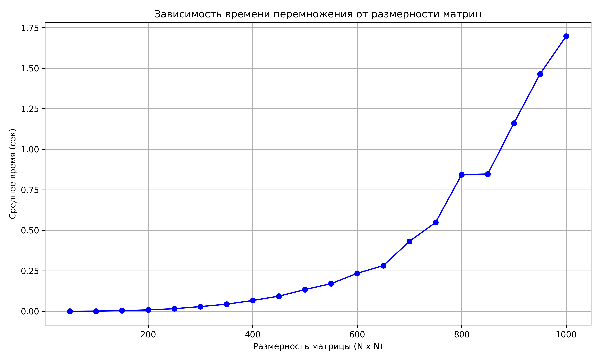

## Отчет по лабораторной работе №1 

### Задание на лабораторную работу: 
   Написать программу на языке C/C++ для перемножения двух матриц.
Исходные данные: файл(ы) содержащие значения исходных матриц.
Выходные данные: файл со значениями результирующей матрицы, время
выполнения, объем задачи.
Обязательна автоматизированная верификация результатов вычислений с помощью
сторонних библиотек или стороннего ПО (например на Matlab/Python).

### Файлы:
* [matrix.cpp](matrix.cpp) - основное задание: генерация, запись/чтение матриц из файлов, их умножение и подсчет времени
* [check.py](check.py) - модуль с функцией проверки полученных результатов с помощью библиотеки numpy (так же чертит график зависимости времени от размера)
* [input](input) - папка со всеми сгенерированными матрицами и результатами их перемножения (в репозитории папка отсутствует так как в ней 600 текстовых файлов матриц, при необходимости могу загрузить эту папку)
* [timing_results.txt](timing_results.txt) - файл, содержащий размеры матриц и среднее время их перемножения (количество экспериментов - по 10 матриц каждой размерности)
  
### Результаты экспериментов и выводы: 
Статистика: 

|Размер|Среднее время, с|
|------------:|-------:|
|50x50	|0.000115|
|100x100|	0.001145|
|150x150|	0.003988|
|200x200|	0.008613|
|250x250|	0.016048|
|300x300|	0.029056|
|350x350|	0.043904|
|400x400|	0.066597|
|450x450|	0.093505|
|500x500|	0.134056|
|550x550|	0.170526|
|600x600|	0.234092|
|650x650|	0.282032|
|700x700|	0.431483|
|750x750|	0.547951|
|800x800|	0.843448|
|850x850|	0.846899|
|900x900|	1.160555|
|950x950|	1.463926|
|1000x1000|	1.697107|

График: 

Вывод: При увеличении размерности матриц, время умножения значительно увеличивается. Исходя из полученных даных, можно сделать вывод о кубическом росте времени выполнения алгоритма.
