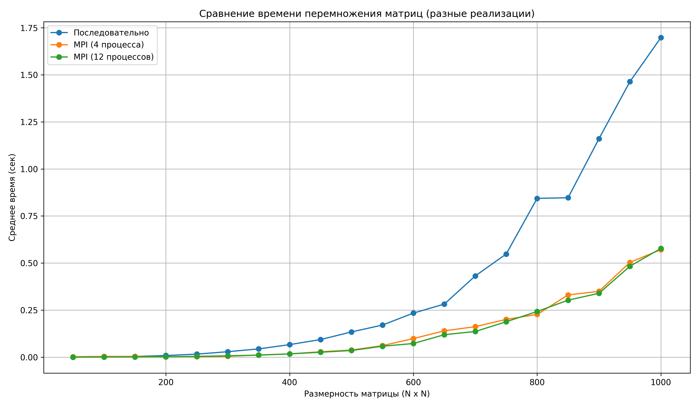
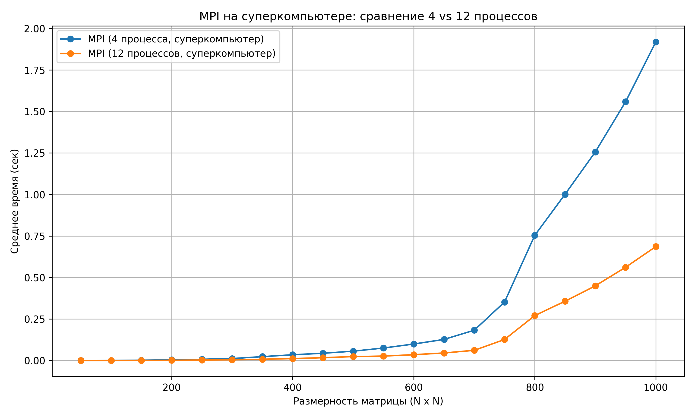

## Отчет по лабораторной работе №3 

### Задание на лабораторную работу: 
   Написать программу на языке C/C++ для перемножения двух матриц.
Исходные данные: файл(ы) содержащие значения исходных матриц.
Выходные данные: файл со значениями результирующей матрицы, время
выполнения, объем задачи.
Обязательна автоматизированная верификация результатов вычислений с помощью
сторонних библиотек или стороннего ПО (например на Matlab/Python).

Программа написана на языке C++ с использованием библиотеки MPI (MPICH). Она предназначена для параллельного умножения двух матриц, хранящихся в текстовых файлах. Все вычисления распределяются между процессами с помощью механизма разделения строк и пересылки данных. 

### Алгоритм работы: 
- Генерация данных (только на процессе с рангом 0): Для каждой размерности создаются 10 пар случайных матриц, которые сохраняются в текстовые файлы. 
- Чтение и подготовка данных: Процесс 0 считывает матрицы из файлов, преобразует их в одномерные массивы и подготавливает к передаче. 
- Распределение данных: Все процессы получают полную матрицу B с помощью MPI_Bcast. Матрица A разделяется по строкам и рассылается между процессами с использованием MPI_Scatterv. 
- Вычисления: Каждый процесс умножает свою часть строк матрицы A на всю матрицу B, формируя соответствующий блок результата. 
- Сбор результатов: Частичные результаты собираются на процессе 0 с помощью MPI_Gatherv и записываются в итоговый файл. 
- Измерение времени: Производится 10 запусков для каждой размерности. Засекается и усредняется время выполнения умножения, которое сохраняется в отдельный файл/

### Файлы:
* [matrix.cpp](matrix.cpp) - основное задание: генерация, запись/чтение матриц из файлов, их умножение и подсчет времени
* [check.py](check.py) - модуль с функцией проверки полученных результатов с помощью библиотеки numpy (так же чертит график зависимости времени от размера)
* [input](input) - папка со всеми сгенерированными матрицами и результатами их перемножения (в репозитории папка отсутствует так как в ней 600 текстовых файлов матриц, при необходимости могу загрузить эту папку)
* [timing_results.txt](timing_results.txt) - файл, содержащий размеры матриц и среднее время их перемножения (количество экспериментов - по 10 матриц каждой размерности)
* [timing_results4.txt](timing_results4.txt) - файл, содержащий размеры матриц и среднее время их перемножения (количество экспериментов - по 10 матриц каждой размерности). Выполнено в 4 процесса через MPI.
* [timing_results12.txt](timing_results12.txt) - файл, содержащий размеры матриц и среднее время их перемножения (количество экспериментов - по 10 матриц каждой размерности). Выполнено в 12 процессов через MPI.
* [4.txt](4.txt) - файл, содержащий размеры матриц и среднее время их перемножения (количество экспериментов - по 5 матриц каждой размерности). Выполнено в 4 процесса через MPI. (Суперкомпьютер)
* [12.txt](12.txt) - файл, содержащий размеры матриц и среднее время их перемножения (количество экспериментов - по 5 матриц каждой размерности). Выполнено в 12 процессов через MPI. (Суперкомпьютер)
* [verification.log](verification.log) - файл, содержащий логи проверки правильности перемножения матриц

### Результаты экспериментов и выводы:
Статистика: 

| Размер     | Время (обычный алгоритм) | Время (4 процесса) | Время (12 процессов) |
|------------|--------------------------|--------------------|----------------------|
| 50x50	     | 0.000115  c              | 0.002144 с         | 0.000083 с           |
| 100x100    | 0.001145  c              | 0.003702 с         | 0.000579 с           |
|  150x150   |	0.003988 c              | 0.003797 с         | 0.000882 c           |
|  200x200   |	0.008613 c              | 0.002321 с         | 0.001946 с           |
|  250x250   |	0.016048 c              | 0.002549 с         | 0.004140 с           |
|  300x300   |	0.029056 c              | 0.004608 с         | 0.007155 с           |
|  350x350   |	0.043904 c              | 0.011707 с         | 0.010788 с           |
|  400x400   |	0.066597 c              | 0.017262 с         | 0.017352 с           |
|  450x450   |	0.093505 c              | 0.028627 с         | 0.026182 с           |
|  500x500   |	0.134056 c              | 0.037613 с         | 0.035468 с           |
|  550x550   |	0.170526 c              | 0.061246 с         | 0.057965 с           |
|  600x600   |	0.234092 c              | 0.098685 с         | 0.072594 с           |
|  650x650   | 	0.282032 c              | 0.139729 с         | 0.119267 с           |
|  700x700   |	0.431483 c              | 0.162012 с         | 0.136313 с           |
|  750x750   |	0.547951 c              | 0.200553 с         | 0.188067 с           |
|  800x800   |	0.843448 c              | 0.226862 с         | 0.242504 с           |
|  850x850   |	0.846899 c              | 0.330609 с         | 0.302759 с           |
|  900x900   |	1.160555 c              | 0.349755 с         | 0.339253 с           |
|  950x950   |	1.463926 c              | 0.503609 с         | 0.483044 с           |
|  1000x1000 |	1.697107 c              | 0.571284 с         | 0.577506 с           |

График: 

### Работа на суперкомпьютере "Сергей Королев"

На суперкомпьютере алгоритм работает более стабильно (происходит практически трехкратное улучшение при увеличении кол-ва потоков в три раза).

## Вывод: 
MPI позволяет эффективно распараллелить вычисления. Производительность ограничивается накладными расходами на передачу данных и синхронизацию между процессами.
